# agent-mqi

**56.4% of the words I type to my AI assistant are negative.
The more I cursed at it, the better my code got.
Here's 2,740 sessions of data proving your frustration isn't a personality flaw. It's a quality signal.**


MQI (Model Quality Index) is a 24-metric composite score that detects when your AI coding assistant is degrading, built from real Claude Code session transcripts.

---

## Your Frustration Is Improving. The Tooling Did That.

We tracked keyword sentiment across 2,740 Claude Code sessions over 13 weeks. As quality hooks, guardrails, and feedback loops matured, average frustration dropped. Not because the user changed. Because the system got better at not deserving it.

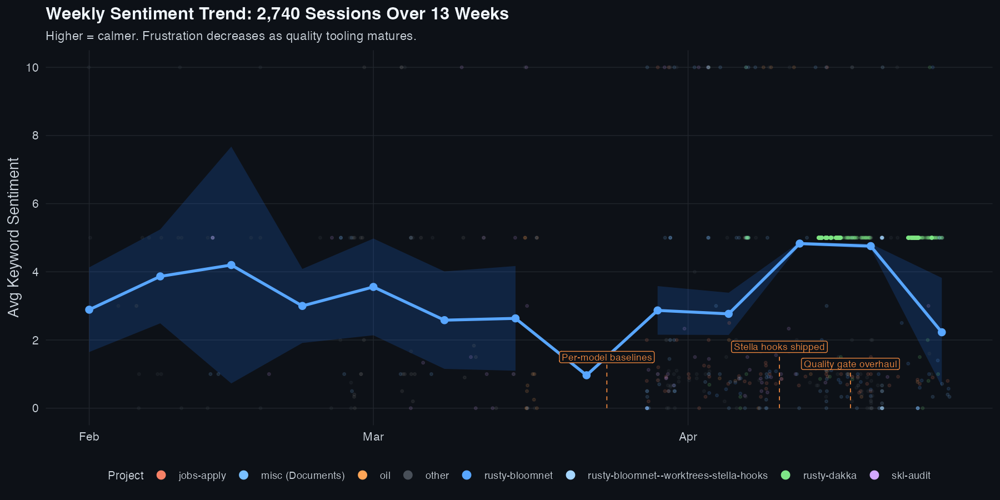

> Reproducible: `Rscript scripts/sentiment-trend.R` against your own data export.

---

## Swearing at Your AI Assistant Is a Feature, Not a Bug

With AI tools, all profanity is expressive by definition. There's no person on the other end. That makes it pure signal.

| | Profanity as a quality signal |
|---|---|
| | *Users define their own keyword lists. These are ours.* |
| **Example 1** | *"so fuckin do it lol wtf are you waiting for"* |
| What triggered it | Agent stalled, explaining a plan instead of executing it. |
| MQI metrics that fire | `keyword_sentiment`, `user_interrupts`, `zero_reasoning_turn_rate` |
| **Example 2** | *"stop being lazy check the console, dom, and screenshots. the counts on each filter are not updating as intended"* |
| What triggered it | Agent skipped research phase, wrote code without checking UI state. |
| MQI metrics that fire | `edits_without_read`, `keyword_sentiment`, `re_instruction_rate` |
| **Key insight** | These aren't outbursts. They're leading indicators of session degradation. MQI captures the intensity and correlates it with 23 other behavioral metrics to determine whether the tool is struggling, not the user. |

Sessions with high expressive profanity (`sentiment > 5.0`) had 2x the tool call count and 3x the duration of calm sessions. These weren't rage-quits. They were the sessions where the user stayed engaged long enough to fight through the problem.

**Research backs this up:**
- [Swearwords and Code Quality](https://cme.h-its.org/exelixis/pubs/JanThesis.pdf): Open source with profanity in comments is statistically better than code without it.
- [156M GitHub Commits](https://medium.com/@sAbakumoff/157-million-github-commits-48-thousand-f-bombs-a84cb9fab680): 0.067% of commit messages contain profanity. Private sessions are a different register entirely.
- [Workplace Swearing (Inc.)](https://www.inc.com/jessica-stillman/workplace-culture-swearing-communication.html): Non-abusive profanity enables development of personal relationships. With AI tools, there's no relationship to damage.

---

## You're Not a Negative Person. We Swear.

Our global keyword ratio is 0.77 (56.4% negative). Before you diagnose us with anger issues, look at the word lists:

| Positive keywords | Negative keywords |
|---|---|
| yes, okay, good, exactly, continue, correct, great, approved, working, done, works, fixed, merged, deployed, clean, perfect, beautiful, awesome, lol, thanks | why, wtf, fuck, enough, shit, fix, error, broken, failed, broke, bad, terrible, still, again, already, wrong, worse, stop, lazy, dumb, retard |

See the problem? Telling your agent "fix the broken deploy" scores 2 negative hits and 0 positive. Saying "the error is still wrong" scores 3 negative, 0 positive. You could be perfectly calm and still run a 60% negative ratio just by doing software engineering.

The negative list is biased toward *problem-solving language*, not anger. MQI knows this. The `keyword_sentiment` metric carries a weight of 0.02 (the lowest tier) precisely because raw word counts overstate negativity. It's a supporting signal, not a verdict.

So no, you don't have anger issues. You have a codebase.

---

## When MQI Drops, Switch Models

Not all models degrade the same way. Here's what 2,740 sessions look like per model:

| Model | Sessions | Avg MQI |
|---|---|---|
| Sonnet 4.6 | 100 | 35.8 |
| Haiku 4.5 | 52 | 28.9 |
| Opus 4.6 | 247 | 12.0 |
| Opus 4.7 | 146 | 10.6 |

Opus scores lower not because it's a worse model, but because we route hard problems to Opus. The sessions are longer, the tasks are more complex, and the failure surface is larger. But when Opus starts degrading *within its own cohort* (MQI drops below its per-model baseline), routing the next task to Sonnet recovers session quality immediately.

In weeks 12-13 we shifted from pure Opus to an Opus+Sonnet mix as Opus quality dropped. This wasn't a hunch. MQI made the degradation visible, and the model switch was the fix.

MQI doesn't just measure. It changes how you work.

---

## Roadmap

**Geographic routing for off-peak inference.** API endpoints are geographically distributed. Off-peak servers in different timezones may have lower contention, leading to measurably better output quality at the cost of added latency. For output-quality-critical tasks (data pipelines, production deploys, long-context reasoning), 50-100ms of added latency is negligible when thinking depth is what matters. We're investigating whether VPN zone-switching to off-peak inference clusters produces measurably higher MQI scores. If it does, MQI becomes not just a diagnostic tool but a routing signal.

---

## Quick Start

### 1. Install

```bash
git clone https://github.com/Alex-Zeo/agent-mqi.git
cd agent-mqi
cargo build --release
```

### 2. Generate Your MQI Score

```bash
./target/release/mqi -o dashboard/data/mqi.json
```

This scans `~/.claude/projects/` for all your session transcripts, computes baselines, and scores each session.

### 3. View the Dashboard

```bash
cd dashboard && python3 -m http.server 8080
# Open http://localhost:8080
```

### 4. Generate the Sentiment Chart

```bash
# Export your data, then run the R script
Rscript scripts/sentiment-trend.R scripts/sentiment-data.csv docs/screenshots/sentiment-trend.png
```

---

## The 24 Metrics

MQI tracks metrics across six behavioral dimensions:

| Group | Metrics | Weight |
|-------|---------|--------|
| **Thinking** | thinking_depth, reasoning_loops, zero_reasoning_turn_rate, redaction_rate | 19% |
| **Research** | read_edit_ratio, research_mutation_ratio, simplest_fix | 16% |
| **Execution** | edits_without_read, write_edit_ratio, premature_stopping, repeated_edits, stop_hook_violations, reversion_rate, post_compaction_drift, human_time_estimation, trial_and_error_debugging | 23% |
| **Trust** | user_interrupts, self_admitted_failures, keyword_sentiment, re_instruction_rate, implicit_constraint_violator | 18% |
| **Throughput** | token_rate_per_minute | 5% |
| **Environment** | incident_exposure, issue_velocity | 19% |

### Key Metrics Explained

- **thinking_depth**: Average length of thinking blocks per turn. Deeper thinking correlates with better outputs.
- **read_edit_ratio**: Research before editing. Sessions that read more files before editing tend to produce better code.
- **user_interrupts**: Times the user interrupted the agent mid-task. High interrupts suggest the agent wasn't meeting expectations.
- **keyword_sentiment**: Ratio of positive to negative keywords in user messages. A supporting signal, not a verdict.
- **incident_exposure**: Fraction of session that overlapped with Anthropic service incidents.

## How It Works

```
~/.claude/projects/          Your Claude Code session transcripts
        |
        v
    mqi CLI                  Parses sessions, extracts 24 metrics
        |
        v
  mqi.json                   Scored sessions with z-scores and status
        |
        v
  Dashboard                  Visualize trends, identify degradation
```

## Scoring Methodology

1. **Transform**: Each metric is transformed to approximate normality (logit for ratios, log1p for counts)
2. **Baseline**: Top-K sessions per model form that model's baseline (not a shared time window)
3. **Z-score**: Compute deviation from baseline using robust estimators
4. **Orient**: Flip sign so positive z always means good performance
5. **Weight**: Weighted sum across all 24 metrics
6. **Scale**: Map to 0-100 using sigmoid

A score of **50 means baseline quality**. Above 50 is better than your historical average; below 50 is worse.

## Per-Model Baselines

New model architectures often trade explicit reasoning for implicit. When Opus 4.7 launched, it showed shorter thinking blocks but better code. Against a pooled baseline dominated by Opus 4.5, every 4.7 session looked "degraded." The fix: compare each model against its own best sessions. Opus 4.7 is measured against Opus 4.7, not Sonnet.

## Dashboard

### WHY MQI MOVED

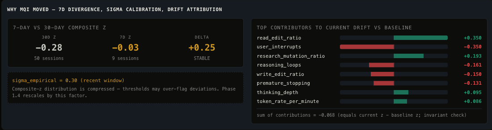

Compares your last 7 days against your last 30 days and tells you which metrics are driving the change. The drift attribution bars on the right show exactly which behavioral dimension shifted. When the 7d and 30d lines diverge, something changed in your workflow or the model's behavior. Start here.

### MQI BY GROUP (RADAR)

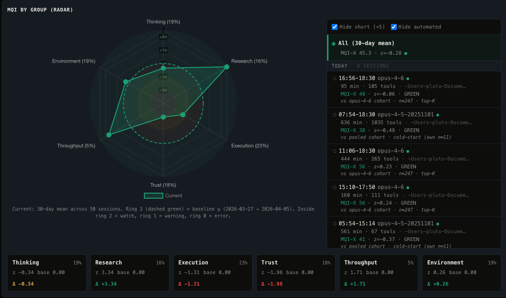

Hexagonal radar chart plotting z-scores across all six behavioral dimensions (Thinking, Research, Execution, Trust, Throughput, Environment). A balanced hexagon means consistent quality. A collapsed vertex means one dimension is degrading. The session picker on the right lets you drill into any individual session to see its radar shape.

### GROUP LEGEND

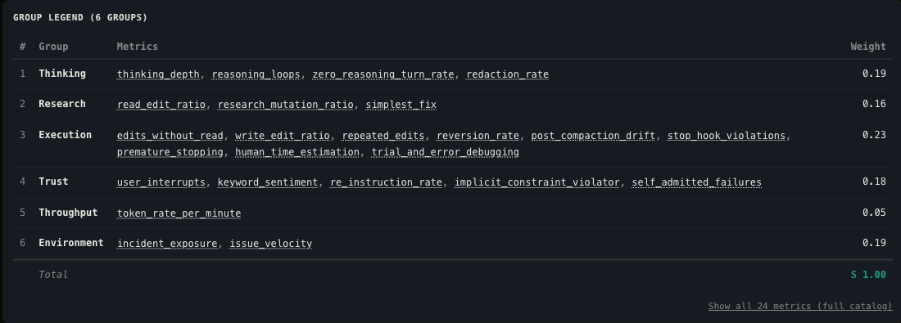

Full breakdown of all 24 metrics organized by group, with weights and status indicators. This is your reference card. Each metric shows its current z-score and whether it's firing above or below baseline. Use this to understand what MQI is actually measuring when a score changes.

### EXTERNAL SIGNALS

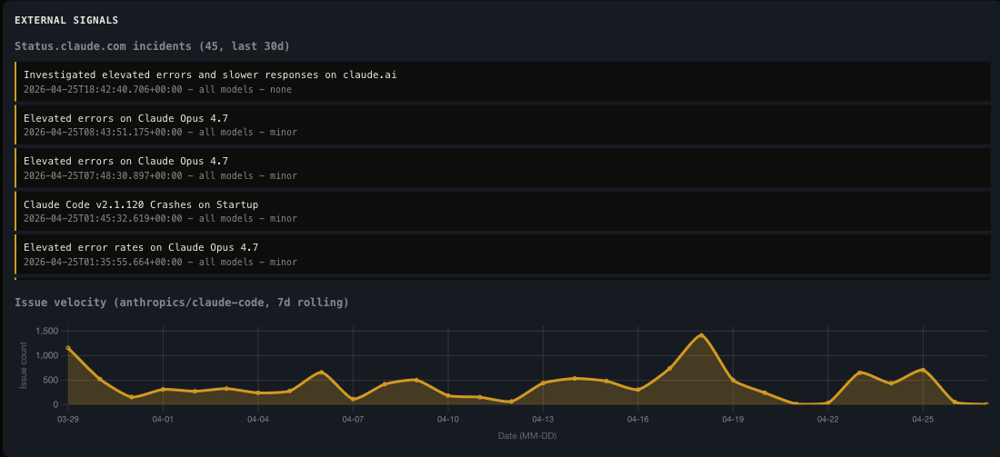

Pulls live incident data from status.claude.com and correlates it with your sessions. The incident feed on the left shows service disruptions. The issue velocity chart on the right shows spikes. Notice the repeated "Elevated errors on Claude Opus 4.7" entries. Now look at which models we were routing to during that same period. This is why `incident_exposure` is a first-class metric: your session quality drops when Anthropic's infrastructure is degraded, and that's not your fault or the model's.

### MQI TREND

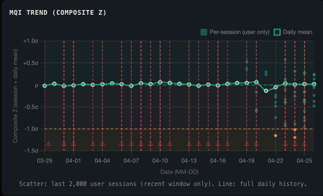

Composite z-score time series with per-session scatter. The trend line shows your rolling quality trajectory. Individual dots are sessions. Drops below the line are degradation events. Use this to spot multi-day slides before they become habits.

### CLAUDE CODE VERSION

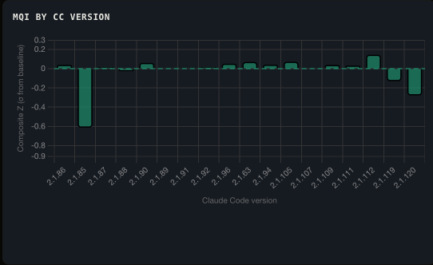

MQI scores bucketed by Claude Code CLI version. When Anthropic ships a new CLI version, your session quality may shift. This chart catches regressions (or improvements) that correlate with tooling updates rather than model changes.

### MQI BY MODEL

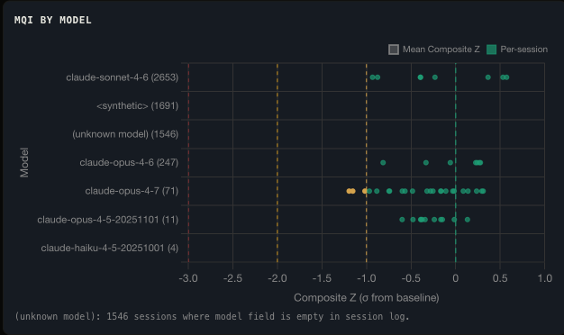

Per-model composite z-score dot plot. Each dot is a session. This is how you compare Opus vs Sonnet vs Haiku at a glance. Remember: Opus scores lower because it handles harder tasks. Compare within cohorts, not across them.

### KEYWORD SENTIMENT

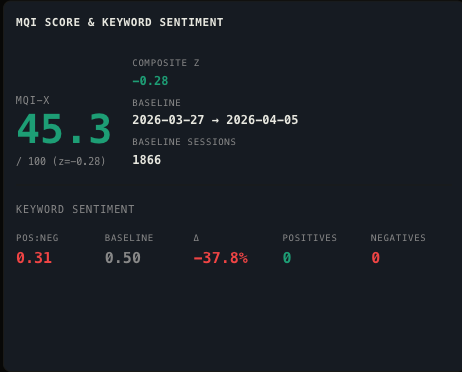

Your MQI score alongside your keyword sentiment ratio. The number on the left is your composite score. The ratio shows positive-to-negative keyword balance. When both drop together, the session is genuinely struggling. When sentiment drops but MQI holds, you're just doing hard engineering work.

### MODEL DEGRADATION

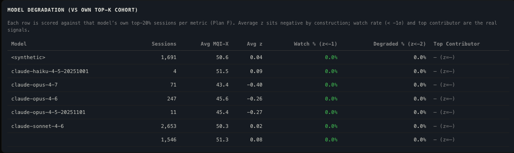

Top-K cohort comparison table per model. Shows each model's best sessions (the baseline cohort) versus recent sessions. When the delta is negative, that model is performing worse than its own historical best. This is the signal that tells you to switch models.

### THINKING DEPTH BY HOUR / DAY

| | |
|---|---|
| 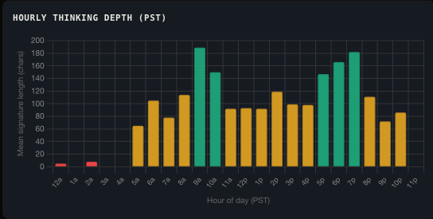 | 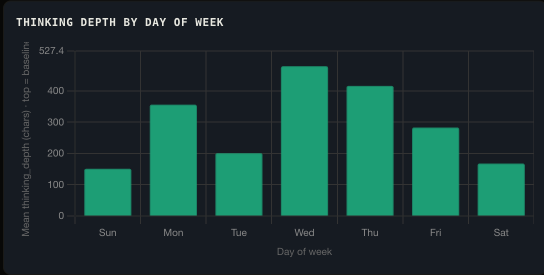 |

Thinking depth broken out by hour of day (PST) and day of week. Deeper thinking correlates with better outputs. If your model thinks less at 2am or on weekends, you now know when to schedule critical work. These charts surface temporal patterns in inference quality that are invisible at the session level.

## Library Usage

```rust
use agent_mqi::{SessionMetrics, score_session, compute_baseline};

struct MySession { /* ... */ }

impl SessionMetrics for MySession {
    fn metric_value(&self, index: usize) -> f64 {
        0.0
    }
}

let baseline = compute_baseline(&sessions, &dates, "2025-01-01", "2025-01-31");
let score = score_session(&current_session, &baseline);
println!("MQI-X: {:.1}/100", score.mqi_x);
```

Add to your `Cargo.toml`:

```toml
[dependencies]
agent-mqi = "0.1"
```

## Example Data

The repo includes example data at `dashboard/data/mqi.example.json` for testing the dashboard without your own sessions.

## License

MIT
