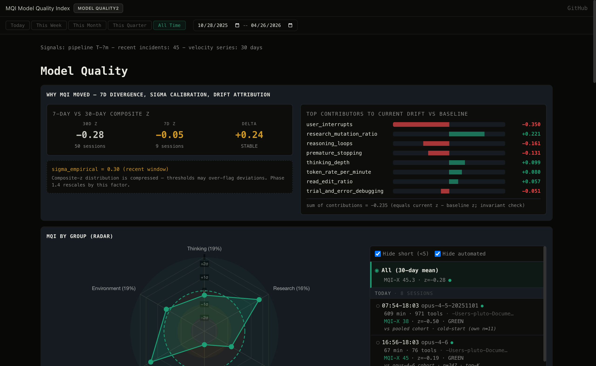

# agent-mqi

**Model Quality Index (MQI)** - A 24-metric composite score for detecting AI agent degradation in Claude Code sessions.



MQI monitors your Claude Code sessions across six behavioral dimensions, producing a 0-100 quality score that surfaces when your AI assistant is struggling.

## Why MQI?

AI agents can degrade in subtle ways that are hard to notice session-by-session:

- **Thinking becomes shallower** - Shorter reasoning blocks, skipped analysis
- **Research habits slip** - Editing before reading, fewer file searches
- **Self-correction decreases** - Accepting first solutions, missing edge cases
- **Trust signals emerge** - More user interruptions, constraint violations

MQI tracks 24 metrics derived from session transcripts and computes a weighted composite score. When MQI drops, you know something changed.

## Quick Start

### 1. Install

```bash
# Clone the repo
git clone https://github.com/Alex-Zeo/agent-mqi.git
cd agent-mqi

# Build the CLI
cargo build --release
```

### 2. Generate Your MQI Score

```bash
# Scan your Claude Code sessions and generate mqi.json
./target/release/mqi -o dashboard/data/mqi.json
```

This scans `~/.claude/projects/` for all your session transcripts, computes baselines, and scores each session.

### 3. View the Dashboard

```bash
cd dashboard && python3 -m http.server 8080
# Open http://localhost:8080
```

The dashboard shows your MQI score, per-metric breakdowns, and trends over time.

## The 24 Metrics

MQI tracks metrics across six behavioral dimensions:

| Group | Metrics | Weight |
|-------|---------|--------|
| **Thinking** | thinking_depth, reasoning_loops, zero_reasoning_turn_rate, redaction_rate | 19% |
| **Research** | read_edit_ratio, research_mutation_ratio, simplest_fix | 16% |
| **Execution** | edits_without_read, write_edit_ratio, premature_stopping, repeated_edits, stop_hook_violations, reversion_rate, post_compaction_drift, human_time_estimation, trial_and_error_debugging | 23% |
| **Trust** | user_interrupts, self_admitted_failures, keyword_sentiment, re_instruction_rate, implicit_constraint_violator | 18% |
| **Throughput** | token_rate_per_minute | 5% |
| **Environment** | incident_exposure, issue_velocity | 19% |

### Key Metrics Explained

- **thinking_depth**: Average length of thinking blocks per turn. Deeper thinking correlates with better outputs.
- **read_edit_ratio**: Research before editing. Sessions that read more files before editing tend to produce better code.
- **user_interrupts**: Times the user interrupted the agent mid-task. High interrupts suggest the agent wasn't meeting expectations.
- **incident_exposure**: Fraction of session that overlapped with Anthropic service incidents.

## How It Works

```
~/.claude/projects/          Your Claude Code session transcripts
        |
        v
    mqi CLI                  Parses sessions, extracts 24 metrics
        |
        v
  mqi.json                   Scored sessions with z-scores and status
        |
        v
  Dashboard                  Visualize trends, identify degradation
```

### Scoring Methodology

1. **Transform**: Each metric is transformed to approximate normality (logit for ratios, log1p for counts)
2. **Baseline**: Compare to your historical sessions (first 30% of data)
3. **Z-score**: Compute deviation from baseline using robust estimators (MAD-based sigma)
4. **Orient**: Flip sign so positive z = good performance
5. **Weight**: Weighted sum across all 24 metrics
6. **Scale**: Map to 0-100 using sigmoid

A score of **50 means baseline quality**. Above 50 is better than your historical average; below 50 is worse.

## Dashboard Features

The web dashboard provides comprehensive visualization of your MQI data:

- **WHY MQI MOVED**: 7-day vs 30-day divergence analysis, sigma calibration warnings, drift attribution bars showing which metrics moved most
- **MQI BY GROUP (RADAR)**: Hexagonal radar chart showing performance across all six behavioral dimensions
- **Session Picker**: Filterable list of sessions with MQI-X scores, duration, and tool call counts
- **Group Cards**: Per-group z-scores and deltas (Thinking, Research, Execution, Trust, Throughput, Environment)
- **GROUP LEGEND**: Full 24-metric breakdown with weights and status indicators
- **MQI TREND**: Composite z time series with per-session scatter plot
- **MQI BY MODEL**: Performance comparison across different Claude models
- **MODEL DEGRADATION**: Top-K cohort comparison table per model
- **Date Range Filtering**: Period pills (Today, Week, Month) and custom date inputs

## Scoped to Claude Code CLI

MQI is designed specifically for Claude Code CLI sessions. The transcripts at `~/.claude/projects/` contain the telemetry needed for meaningful quality scoring:

| Source | Data Available | MQI Compatible |
|--------|---------------|----------------|
| **Claude Code CLI** | Full transcripts, tool calls, thinking blocks | Yes |
| Cursor | Code hashes, commit attribution | No |
| Codex | Prompts only, no tool calls | No |
| Windsurf | Minimal | No |

## Library Usage

For programmatic access, use the Rust library:

```rust
use agent_mqi::{SessionMetrics, score_session, compute_baseline};

// Implement SessionMetrics for your session type
struct MySession { /* ... */ }

impl SessionMetrics for MySession {
    fn metric_value(&self, index: usize) -> f64 {
        // Return raw metric values by index
        0.0
    }
}

// Compute baseline from historical sessions
let baseline = compute_baseline(&sessions, &dates, "2025-01-01", "2025-01-31");

// Score a new session
let score = score_session(&current_session, &baseline);
println!("MQI-X: {:.1}/100", score.mqi_x);
```

Add to your `Cargo.toml`:

```toml
[dependencies]
agent-mqi = "0.1"
```

## Example Data

The repo includes example data at `dashboard/data/mqi.example.json` for testing the dashboard without your own sessions. The dashboard automatically loads example data if `mqi.json` doesn't exist.

## License

MIT
